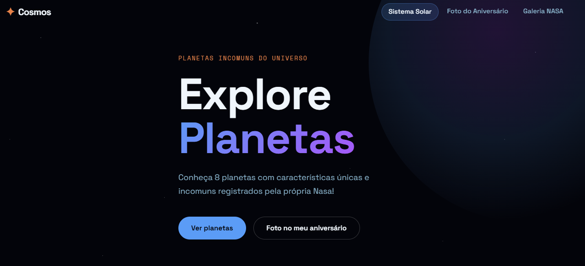
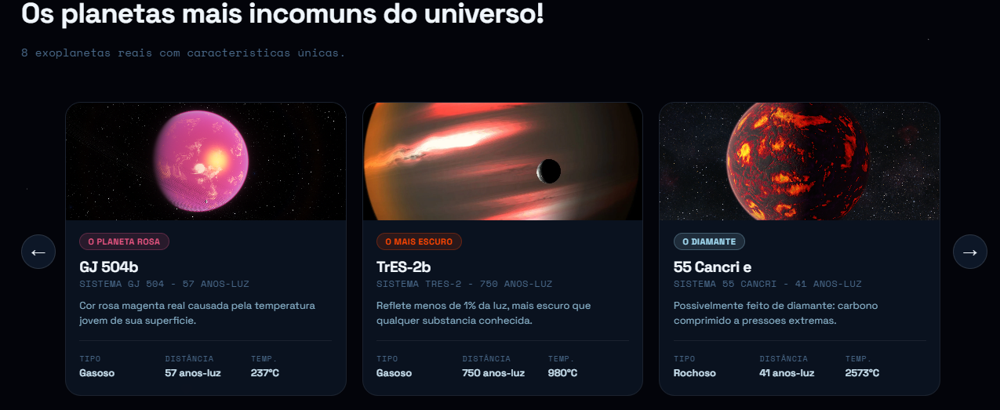
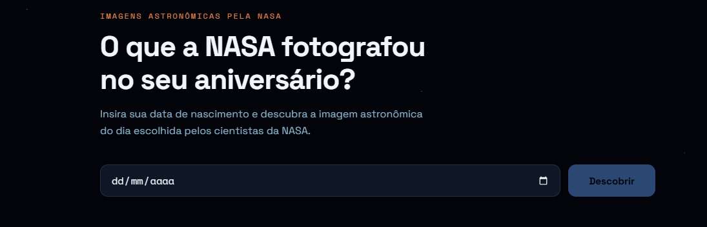
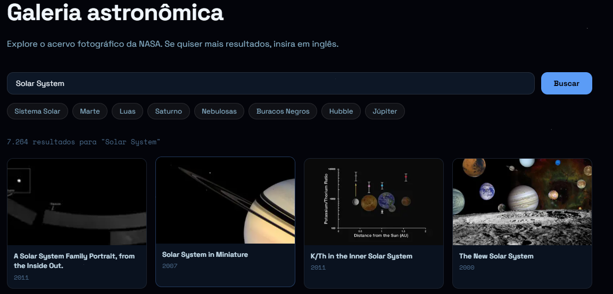

---
# Cosmos Planets

<p align="center">
  
  
 
  
  
  
</p>

<p align="center">
  Explore um catálogo interativo de planetas incomuns reais do nosso sitema solar com uma interface moderna e uma experiência inspirada na exploração espacial através de imagens.</strong>
</p>

---

## Hospedagem online
Hospedagem automatizada na plataforma 'VERCEL', teste:
```
https://cosmos-planets.vercel.app/
```

## Sobre o projeto

**Cosmos Planets** é uma aplicação web desenvolvida para portifólio trazendo uma boa interface e integração de APIs públicas da NASA para interação e 'exploração' de imagens e conteúdo espacial!

---

## Funcionalidades

* Cards de planetas
* Barra de pesquisa
* Exploração de imagens espaciais
* Interação com as APIs
* Carrossel de cards

---

## Demonstração

> Imagens de demonstração do projeto

## Home 



## Carrossel de Cards


## API de aniversário



## Galeria


---

## Tecnologias utilizadas

### Front-end

* Next.js
* React
* JavaScript
* CSS3

### Back-end

* Next.js, API Routes

### Banco de dados

* PostgreSQL, Neon
* @vercel/postgres

### APIs utilizadas

- **NASA APOD** — `https://api.nasa.gov/planetary/apod` — foto astronômica do dia por data.
- **NASA Image Library** — `https://images-api.nasa.gov/search` — acervo de imagens.

---

##  Estrutura do projeto

```
cosmos-planets/
├── database/
│   └── schema.sql          
├── src/
│   ├── app/
│   │   ├── api/
│   │   │   ├── planets/    
│   │   │   └── nasa/      
│   │   ├── birthday-photo/
│   │   ├── gallery/
│   │   └── page.js         
│   ├── components/
│   │   ├── planets/        
│   │   ├── nasa/          
│   │   └── ui/             
│   └── lib/
│       ├── db.js            
│       └── schema.js        
└── .env.example
```

---

## Como instalar o projeto

### 1. Clone o repositório

```bash
git clone https://github.com/laiscastroc/cosmos-planets.git
```

### 2. Acesse a pasta

```bash
cd cosmos-planets
```

### 3. Instale as dependências

```bash
npm install
```

### 4. Configure as variáveis de ambiente

Crie um arquivo:

```env
.env.local
```

Exemplos:

```env
POSTGRES_URL=
POSTGRES_PRISMA_URL=
POSTGRES_DATABASE=
```

---

### 5. Execute o projeto

```bash
npm run dev
```

A aplicação estará disponível em:

```
http://localhost:3000
```

---

## Melhorias futuras

* Sistema de favoritos
* Filtros por tipo de planeta
* Paginação
* Autenticação de usuários
* Tema claro/escuro

---

## Desenvolvedor

Laís Castro, para saber mais, acesse:

GitHub:

https://github.com/laiscastroc

LinkedIn:

https://www.linkedin.com/in/la%C3%ADs-castro/

Email:

laisccastroc2023@gmail.com

---

# Licença

Distribuído sob licença MIT.

---

# Donations
Se quiser contribuir com algo em valor, meu PIX:

```
minemiledois@gmail.com
```

<br>
<br>
<p align= "center">
  <a href="https://emoji.gg/emoji/5349-hellokittybyebye"></a>
</p>

