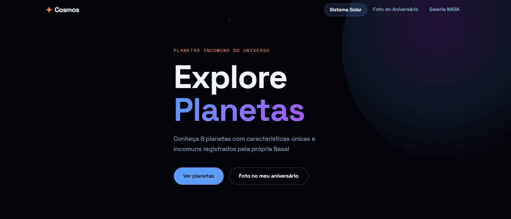
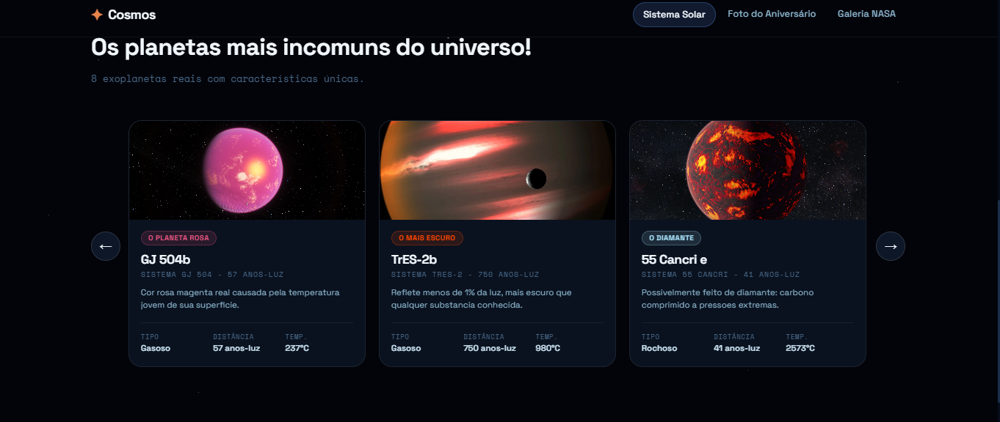
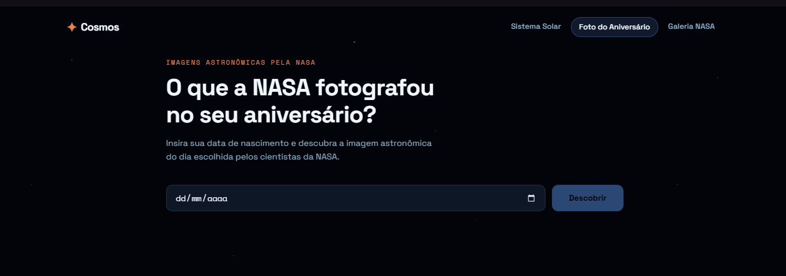
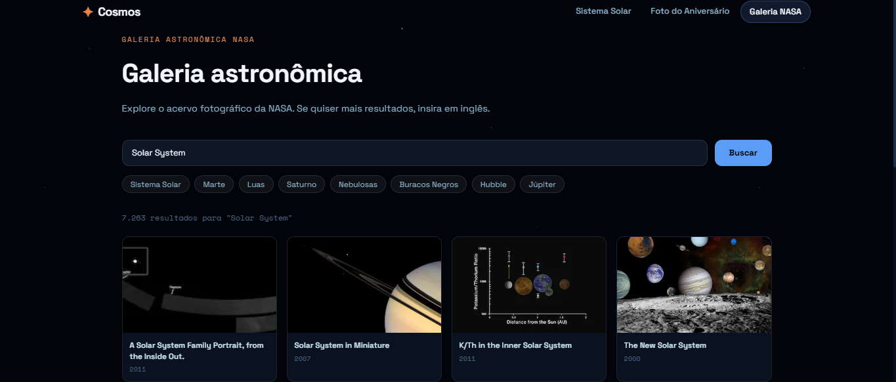

# Cosmos — Planetas Incomuns



Explore planetas do Sistema Solar com características únicas e descubra o que a NASA fotografou no dia do seu aniversário.

**Stack:** Next.js 14 · React 18 · Neon (PostgreSQL) · Drizzle ORM · NASA APIs · JavaScript

---

## Deploy online
O site atualmente está hospedado na VERCEL, acesse: 
```
https://cosmos-planets.vercel.app/
```

## Funcionalidades

- 🪐 **Planetas** — listagem de planetas com cards, modal com detalhes.

- 🎂 **Foto do Aniversário** — NASA APOD: insira sua data de nascimento e veja a imagem astronômica do dia tirada pela NASA.

- 🖼️ **Galeria NASA** — NASA Image Library: barra de pesquisa para exibir imagens relativas à pesquisa feita. _Ex.: Marte -> vai mostrar imagens de Marte._


---

## Pré-requisitos

- Node.js 18+
- Conta no [Neon](https://neon.tech) (banco PostgreSQL gratuito)
- Chave da [NASA APIs](https://api.nasa.gov/) (gratuita)

---

## Estrutura do projeto

```
cosmos-planets/
├── database/
│   └── schema.sql          ← sql para neon
├── src/
│   ├── app/
│   │   ├── api/
│   │   │   ├── planets/    ← GET/POST planetas
│   │   │   └── nasa/       ← APOD + Gallery
│   │   ├── birthday-photo/
│   │   ├── gallery/
│   │   └── page.js         ← Home
│   ├── components/
│   │   ├── planets/        ← PlanetGrid, PlanetCard, PlanetModal
│   │   ├── nasa/           ← BirthdayPhoto, NasaGallery
│   │   └── ui/             ← Navbar, Hero, Footer
│   └── lib/
│       ├── db.js            ← Conexão Neon/Drizzle
│       └── schema.js        ← Definição das tabelas
└── .env.example
```

---

## APIs utilizadas

- **NASA APOD** — `https://api.nasa.gov/planetary/apod` — foto astronômica do dia por data.
- **NASA Image Library** — `https://images-api.nasa.gov/search` — acervo de imagens.

---

## Desenvolvedor(a)
Laís Castro | Desenvolvedora WEB

---

## Contatos
- LINKEDIN: www.linkedin.com/in/laís-castro
- EMAIL: laisccastroc2023@gmail.com
